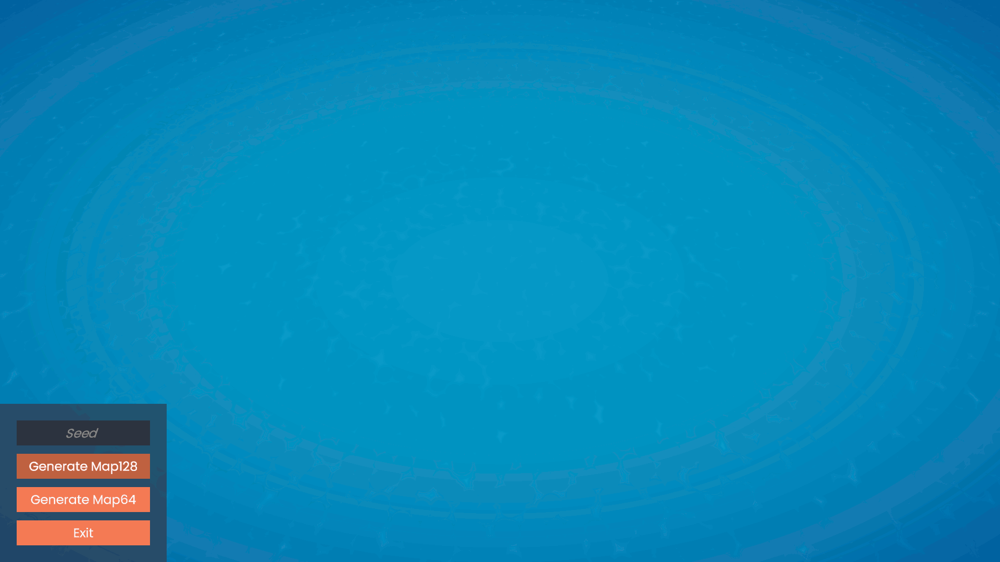

# Hex Map Generator


# What is a Hex Map Generator?

This is a simple demonstration of using several algorithms to create a hexagonal map complete with biomes and resources.

# Useful information

Catlike Coding: https://catlikecoding.com/unity/tutorials/hex-map/  
Red Blob Games: https://www.redblobgames.com/grids/hexagons/  
Sebastian Lague: https://www.youtube.com/playlist?list=PLFt_AvWsXl0eBW2EiBtl_sxmDtSgZBxB3  

# Control

```WSAD``` - camera movement.  
```QE``` - camera rotation.  
```Mouse Scroll Wheel``` - zoom in or out.  
```Left Mouse Button``` - when you click on a hexagon, it displays information about it.  

# Screenshots


